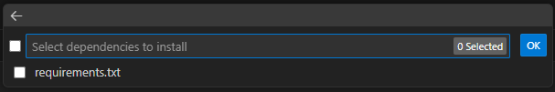

# FastAPI Example Website

This repository is me converting my example website repo into a FastAPI app. Another repo will include me trying to connect Fastapi with p5.js.

---

## Current Plans
Improving speed

## Getting Started

Set up a Python environment. 
Below are the steps for setting up in Visual Studio Code (VS Code):

### Setting Up Your Environment

1. **Open VS Code** and press `Ctrl + Shift + P`.
2. Type and select **Python: Select Interpreter**.
3. Create a virtual environment and select it (name it `venv`).
4. Ensure you’re using **Python 3.10** or above. If Python 3.10 is not installed, download it from the official [Python website](https://www.python.org/downloads/).

Once this is done, you should see a prompt confirming that your environment is ready. It might look something like this:



### Install Project Dependencies

After setting up the virtual environment, you can install the required dependencies by running:

```bash
pip install -r requirements.txt
```

This will install all the necessary libraries for running the FastAPI app.

---

## Running the Program

Once you’ve set up the environment and installed dependencies, you can run the FastAPI application.

### Running in VS Code

1. **Open the terminal** within VS Code (`Ctrl + ~`).
2. Run the following command to start the FastAPI server:

   ```bash
   uvicorn main:app --reload
   ```
   It might also work by downloading the recommended vscode extension and then opening the main.py file and pressing: 
   

3. You should see the following output on the terminal indicating that the server is running:

   ```bash
   Uvicorn running on http://127.0.0.1:8000 (Press CTRL+C to quit)
   ```

4. Open your browser and navigate to `http://127.0.0.1:8000` to view the website.

---
<!-- Gotta try using render
https://docs.render.com/free -->